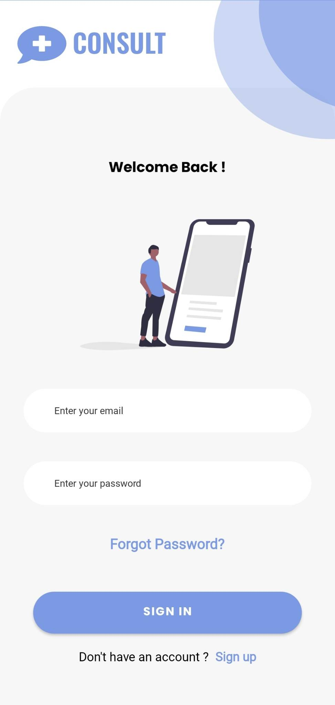
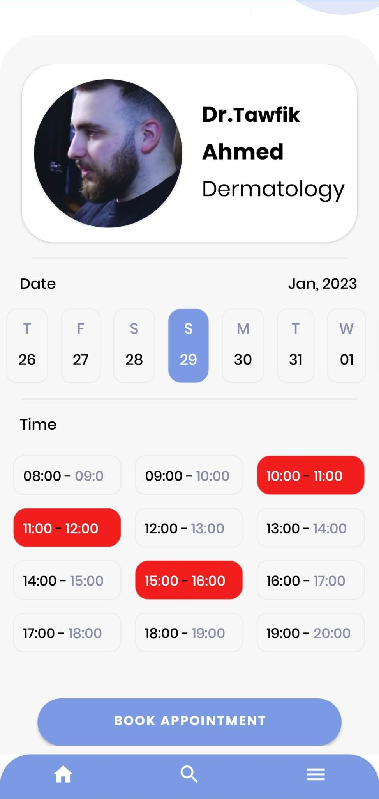
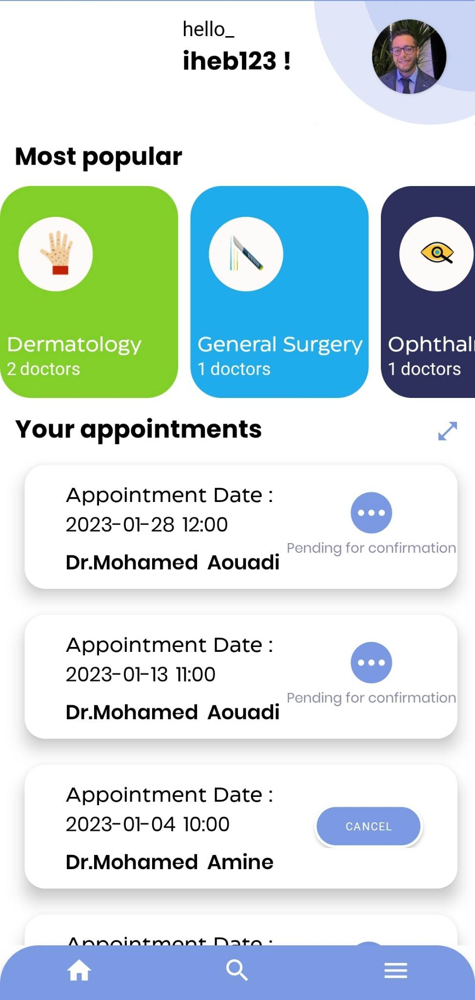

   <h1>ConsultPlus</h1>

        
        
        
      

      
A mobile app to help patients make instant appointments with doctors. Built with Kotlin and Node.js 

      <h2>Installation</h2>
      <pre><code>git clone https://github.com/aminesaadaoui/Consult_plus.git</code></pre>
      
Install the dependencies:

      <pre><code># for Android Studio, dependencies are automatically installed</code></pre>
      
Run the application:

      <pre><code># for Android Studio, run the app with emulator or physical device</code></pre>
      

